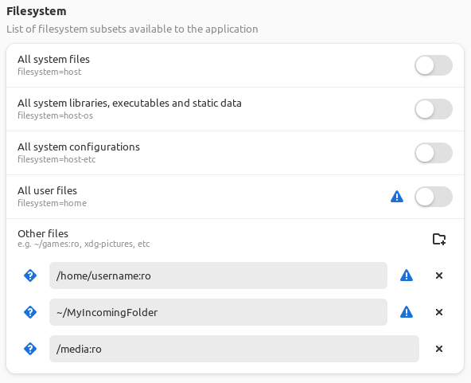
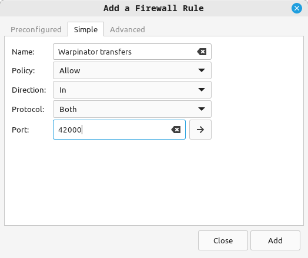
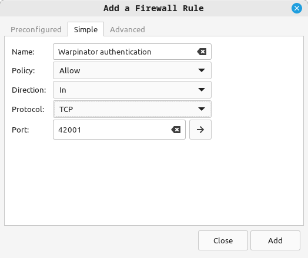
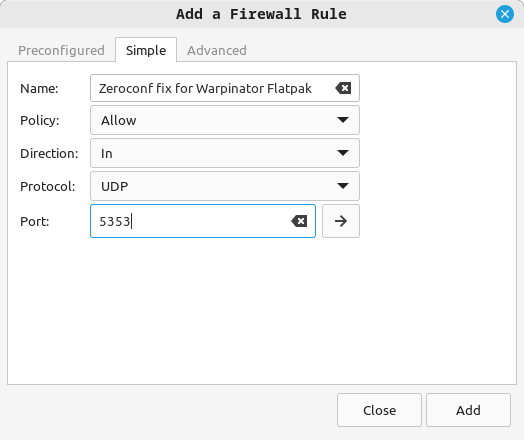
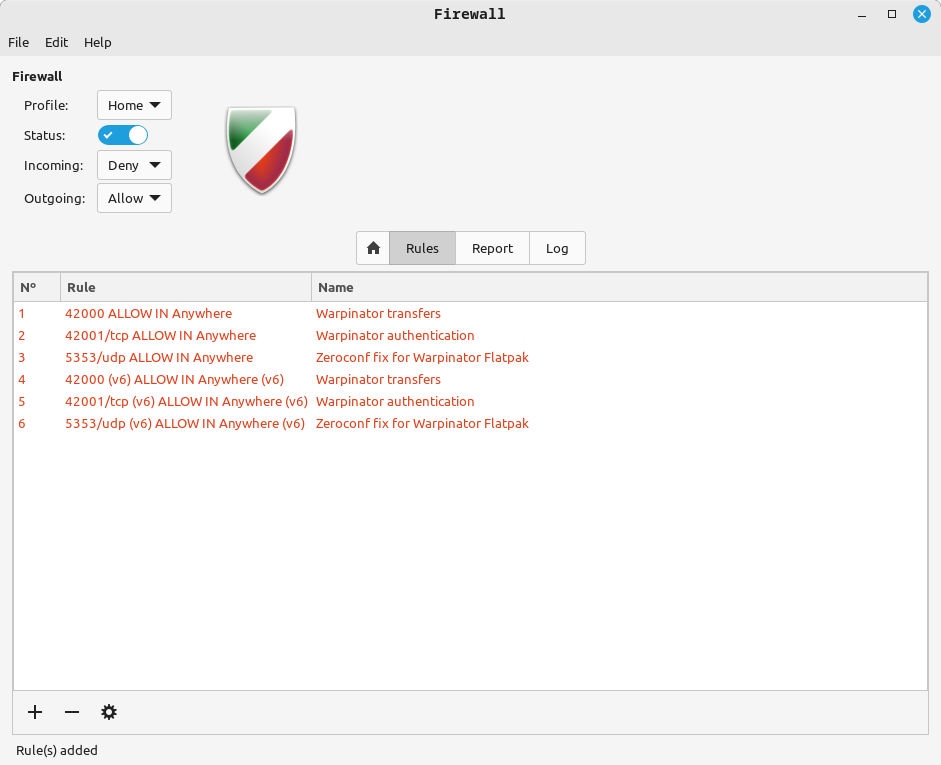

# Warpinator - send and receive files across a local network


##### Other platforms (unofficial):

- Android: https://github.com/slowscript/warpinator-android
- iOS: https://github.com/williamMillington/warpinator-iOS (beta)
- Windows: https://winpinator.swisz.cz
- Windows: https://github.com/slowscript/warpinator-windows

### How to build and install for Linux
________

#### Mint 20+, LMDE 4+:
```
sudo apt-get install warpinator
```

#### Ubuntu 20.04, related:
```bash
# Install build dependencies listed below, note minimum versions:
sudo apt-get install python3-grpc-tools python3-grpcio

# Clone this repo:
git clone https://github.com/linuxmint/warpinator.git

# Enter the folder, specify version:
cd warpinator

# Check out a version you want, or skip this step to build off the current source.
git checkout 1.2.3

# Try to build. If this fails, it's probably due to missing dependencies.
# If you use GitHub Actions to compile, please install the following dependencies.
sudo apt-get -y install debhelper dh-python gnome-pkg-tools meson gobject-introspection appstream python3-grpc-tools

# Take note of these packages, install them using apt-get:
dpkg-buildpackage --no-sign

# Once that succeeds, install:
cd ..
sudo dpkg -i *warp*.deb

# If this fails, make note of missing runtime dependencies (check list below),
# install them, repeat previous command (apt-get install -f may also work).
```
##### Note for Mint 19.x and Ubuntu Bionic (18.04) users:

Add this PPA to satisfy dependencies, then you can follow steps above:
<https://launchpad.net/~clementlefebvre/+archive/ubuntu/grpc?field.series_filter=bionic>

#### Arch Linux:

For any desktop environment (DE)
```
sudo pacman -S warpinator
```

#### Otherwise (and this is valid anywhere if you want to avoid packaging):
```bash
meson builddir --prefix=/usr # (This is typical - /usr/local is another common choice for non-package-manager installs).
ninja -C builddir
sudo ninja -C builddir install
```
#### Flatpak

For any Linux distro with flatpak support you can also install it from [Flathub](https://flathub.org/apps/details/org.x.Warpinator):
```
flatpak install flathub org.x.Warpinator
```
_____
##### build deps (ref: debian/control)
- meson (>= 0.45.0)
- python3-grpc-tools (>= 1.14.0)
- python3-protobuf (>= 3.6.1)
- gobject-introspection

##### required only for makepot
- appstream,
- policykit-1,

##### runtime deps
- gir1.2-glib-2.0
- gir1.2-gtk-3.0 (>= 3.20.0)
- gir1.2-xapp-1.0 (>= 1.6.0)
- python3
- python3-gi
- python3-setproctitle
- python3-xapp (>= 1.6.0)
- python3-zeroconf (>= 0.27.0) *** see note below
- python3-grpcio (>= 1.16.0)
- python3-cryptography
- python3-nacl

##### Note about zeroconf
As of v1.2.0, the build attempts to download and install/package zeroconf to the warpinator install dir (or package). To disable this and have warpinator use the system's version, set the 'bundle-zeroconf' build option to false:
```
meson builddir --prefix=/usr -Dbundle-zeroconf=false
ninja -C builddir
sudo ninja -C builddir install
```

##### You can get grpcio and grpc-tools from pip3 also:
```
pip3 install grpcio grpcio-tools
```

# Security Considerations
## Secure Mode
### Group codes
The group code is a shared key that allows trusted devices on the local network to see one another in Warpinator. Any devices you wish to connect with *must* be using the same group code. This code is set to 'Warpinator' by default.
### Enabling secure mode
Secure mode can be enabled simply by changing the group code to something unique. It is *highly recommended* that you do this as soon as possible, as anyone else that gets on your network would then be able to connect with you with little effort.

##### Certain restrictions are put in place until Secure Mode is enabled:
- Starting automatically at login is disabled.
- All incoming transfers *must* be approved by the user.
- Warpinator will exit after sixty minutes.
##### Additional information:
- It is recommended that the code only consist of standard alphanumeric characters.
- The code must between 8 and 32 characters. If you decide to use non-ascii characters, the maximum length may end up being shorter.

## Folder Isolation
### Overview
There is potential for incoming files to be manipulated by a sender in a manner that might cause harm to your system, making use of symbolic links (files that point to other files or folders). Warpinator tries to detect and prevent this, but can also make use of other tools to provide more protection.
#### [Landlock](https://docs.kernel.org/security/landlock.html):
Landlock is a relatively new security module for the Linux Kernel that allows a program to fine-tune how it can access your filesystem. In the context of Warpinator, it allows us to completely isolate your incoming folder - it essentially exists in a vacuum during transfers. Warpinator uses this automatically if it's available.
#### [Bubblewrap](https://github.com/containers/bubblewrap#readme):
Bubblewrap (or bwrap) is a tool that can be used to construct a restrictive environment that a program operate in. For Warpinator, Using bubblewrap provides an experience similar to Landlock, in that only your incoming folder can be written to. There are a couple of minor disadvantages, however: Changing your incoming folder location will require Warpinator to be restarted, and the rest of your filesystem will be read-only (for instance, you won't be able to create new folders elsewhere on your system from Warpinator's file dialog). Warpinator will attempt to use this if Landlock is not available.
#### Legacy (No isolation):
If both Landlock and Bubblewrap are unavailable, Warpinator will operate without and folder isolation, though incoming transfers will still be analyzed to try and catch any potentially harmful files.
#### Flatpak users:
Only landlock or legacy modes are available when using the Warpinator Flatpak, as bubblewrap is already utilized by Flatpak itself. If Landlock is not available (see additional information below for how to check this), you will want to lock your Home directory down yourself using either command-line arguments or the 'Flatseal' utility (which is itself a flatpak).

To do this from the command line (or a custom launcher), you can use the following:
```
flatpak run --filesystem=home:ro --filesystem=<path-to-your-save-folder> org.x.Warpinator --mode=legacy
```
To make the change permanently using Flatseal:
- Install Flatseal from [Flathub](https://flathub.org/apps/com.github.tchx84.Flatseal).
- Launch it and select Warpinator from the Applications list.
- Scroll down to the 'Filesystem' section
- Turn OFF "All user files"
- In 'Other files', click the new folder icon, and in the new field, enter the full path to your home folder with `:ro` at the end (this should look something like `/home/username:ro`).
- Click the new folder icon again, and in the new field enter the path to the location you've selected as Warpinator's incoming folder. You can use the format `~/MyIncomingFolder` or `/home/username/MyIncomingFolder`.

When you're finished, it should look something like this:


Make sure you restart Warpinator after making these changes.

### Additional information:
- Landlock is only available in kernel version 5.13 or higher, and must also be enabled. You can check if it's available by running `cat /sys/kernel/security/lsm | grep landlock` from a terminal.
- Bubblewrap is available in most distributions using your system's package manager.
- You can specify a tool to use that will override Warpinator's auto-detection. See `warpinator --help` for information.

# Troubleshooting tips

### Improving transfer speeds
#### **Enable compression**:
Beginning in version 1.2.0, transfers can potentially be sped up by enabling compression. **Note:** this will only work if the sending and receiving machine *both support it*. It can be enabled in General Preferences:


### Solving connection issues
#### **Check your group code**:
All devices that wish to connnect *must* share the same group code. Any that do not will be ignored. **Tip:** You should first choose a unique code before setting up additional devices. Do *not* leave it as the default "Warpinator".
#### **Make sure you're using a valid network interface**:
All devices must be on the same local subnet in order to connect. While Warpinator will generally 'get this right' on its own, it can fail depending on various factors. An easy way to tell is to compare the IP address of both devices. You can check this in the lower right-hand corner of the Warpinator window. In most home-based networks, this value will start with `192.168.1`. For devices to see one another, they must all share that part of the address. The last set of digits will differ on each device. If there are additional differences, the devices will probably not be able to connect.

- If you're running Warpinator in a virtual machine, make sure you've set it up to use a 'bridged' network adapter. This enables the VM to appear as a real computer on the network. If you don't do this, it won't be visible to other Warpinator devices on the network. In VirtualBox, this can be changed as shown:


- If you are connected to multiple networks, you may need to select a specific interface in Preferences:


- Make sure you don't have a VPN currently enabled on the device. Allowing 'LAN traffic' in your VPN configuration can sometimes avoid this problem, though you should disable the VPN entirely until you can confirm there are no connection issues without it.
#### **Make sure your firewall is configured properly, if one is being used:**
In order for devices to connect with one another, rules must be added for Warpinator, to allow incoming traffic for the specific ports Warpinator uses.

 By default, port 42000 is used for transfers, and 42001 is used for authentication. In current versions of Warpinator (after 1.2.0), only TCP is required, but you should also allow UDP traffic on the transfer port to allow connections with older Warpinator versions.
 
 **Note: If you are planning to use the Flatpak version to connect to other machines using Flatpak, you need to open UDP port 5353 as well as those mentioned above. Even if the port is already opened according to gufw, it must be explicitly opened here.**

- If you use [gufw](https://gufw.org), Warpinator can add the rules for you (this is not available for the Flatpak version):

- If you're using the Flatpak version, you can add the rules to gufw by adding 'Simple' rules:



and



and



You should end up with:



#### **Check under the hood:**
It's possible there is something else causing your connection issues that is not covered here. You can run Warpinator in debug mode to gather additional information to troubleshoot (or to attach to an Issue report here).
- First, make sure Warpinator isn't already running - open the menu and click 'Quit'. Simply closing the window will not necessarily end the program, if you have the status icon enabled.


- Then, open a terminal and run:
```bash
warpinator --debug

# If you're running the Flatpak version, use this instead:

flatpak run --command=warpinator org.x.Warpinator --debug
```
This will cause a great deal of useful information to be logged to the terminal. You can copy this and attach it to a bug report here. This will give us a good head start on assisting you.

**Note:** Please don't copy/paste the text directly into the issue. You can save it into a text file, then simply drag the file into the editor here.
